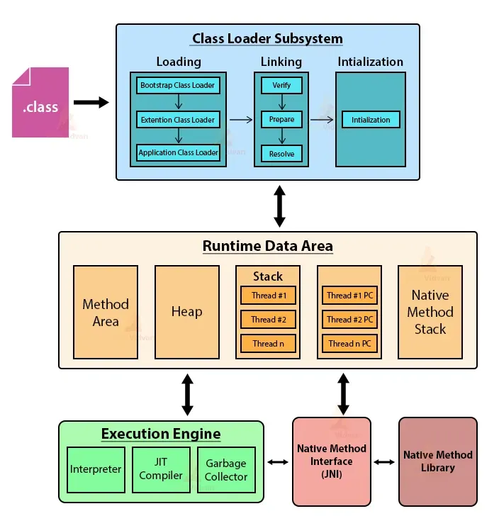

# JVM Architecture

### **1. Overview of JVM Architecture**  
JVM (Java Virtual Machine) is the heart of Java, responsible for executing Java programs. It consists of several components that work together to transform Java code into machine-executable instructions.  

    

### **2. Key Components of JVM Architecture**  
- **Class Loader Subsystem**  
- **JVM Memory**  
- **Execution Engine**  
- **Native Interface and Libraries**  

---

### **2.1 Class Loader Subsystem**  
**Purpose:** Loads, links, and initializes classes for execution.  

**Three Core Responsibilities:**  
- **Loading:** Reads `.class` files and converts them to binary data (0s and 1s), storing class information in the **Method Area**.  
  - Stores: Class name, parent class, interfaces, methods, variables, and modifiers.  
- **Linking:** Ensures the `.class` file is correct and prepares it for execution.  
  - **Verification:** Ensures the format and structure of the class file are correct (throws `VerifyError` if invalid).  
  - **Preparation:** Allocates memory for static members and default values.  
  - **Resolution:** Replaces symbolic references with direct memory addresses.  
- **Initialization:** Assigns actual values to static variables, starting from top to bottom.  

**Types of Class Loaders:**  
1. **Bootstrap Class Loader:** Loads core Java classes (`java.lang`, etc.) from `Java_Home/jre/lib`.  
2. **Extension Class Loader:** Loads classes from the `lib/ext` directory.  
3. **Application Class Loader:** Loads application-specific classes from the classpath.  

**Delegation Model:**  
- Bootstrap → Extension → Application  

---

### **2.2 JVM Memory Structure**  
JVM memory is divided into five main areas for efficient storage and management of data during program execution.  

#### **2.2.1 Method Area:**  
- Stores class-level information like class names, parent classes, variables, and methods.  
- Shared across threads.  

#### **2.2.2 Heap Area:**  
- Stores object instances and their related data.  
- One heap per JVM (shared resource).  
- Essential for Java's object-oriented nature.  

#### **2.2.3 Stack Memory:**  
- Stores method calls and local variables.  
- Each thread has its own stack.  
- **Stack Frame:** Each method call creates a frame that stores local variables and partial results.  
- Stack is destroyed when the thread is terminated.  

#### **2.2.4 PC Registers:**  
- Store the address of the currently executing instruction for each thread.  
- Not shared among threads.  

#### **2.2.5 Native Method Stack:**  
- Stores information about native methods (methods written in languages other than Java, such as C/C++).  

---

### **2.3 Execution Engine**  
Responsible for executing the bytecode instructions.  

**Three Core Components:**  
1. **Interpreter:**  
   - Reads bytecode line by line and executes it.  
   - **Disadvantage:** Slower when a method is called repeatedly.  

2. **Just-In-Time (JIT) Compiler:**  
   - Converts bytecode to native code at runtime to improve performance.  
   - Helps the interpreter avoid reinterpreting frequently called methods.  

3. **Garbage Collector:**  
   - Automatically removes unused objects from memory to free up space.  

---

### **2.4 Native Interface and Native Libraries**  
1. **JNI (Java Native Interface):**  
   - An interface to connect JVM with native code written in languages like C or C++.  
2. **Native Libraries:**  
   - Libraries required by JVM to execute native code.  

---

### **3. Execution Flow Summary**  
1. **Class Loader:** Loads `.class` files, links, and initializes them.  
2. **JVM Memory:** Stores class information, objects, method calls, and execution states.  
3. **Execution Engine:** Executes bytecode line by line or compiles it to native code using the JIT compiler.  
4. **Garbage Collector:** Cleans up unused objects.  
5. **Native Interface:** Facilitates integration with native libraries.  

---

### **4. Key Takeaways for Long-Term Retention**  
- **Understand the Class Loader’s role:** Load, Link, and Initialize classes.  
- **Visualize the JVM Memory Structure:** Method Area, Heap, Stack, PC Registers, and Native Method Stack.  
- **Focus on the Execution Engine components:** Interpreter, JIT Compiler, and Garbage Collector.  
- **Remember JNI and Native Libraries:** For integrating external code.  
